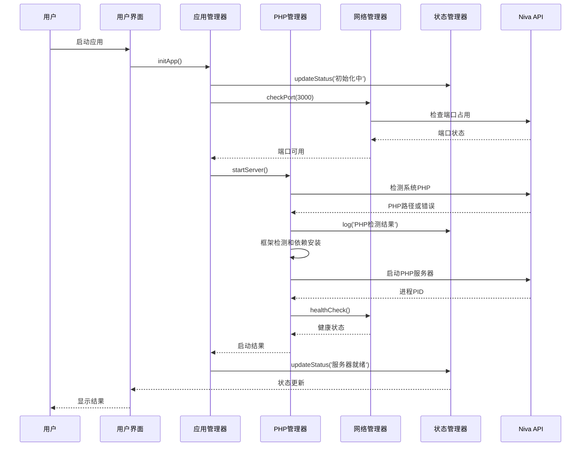
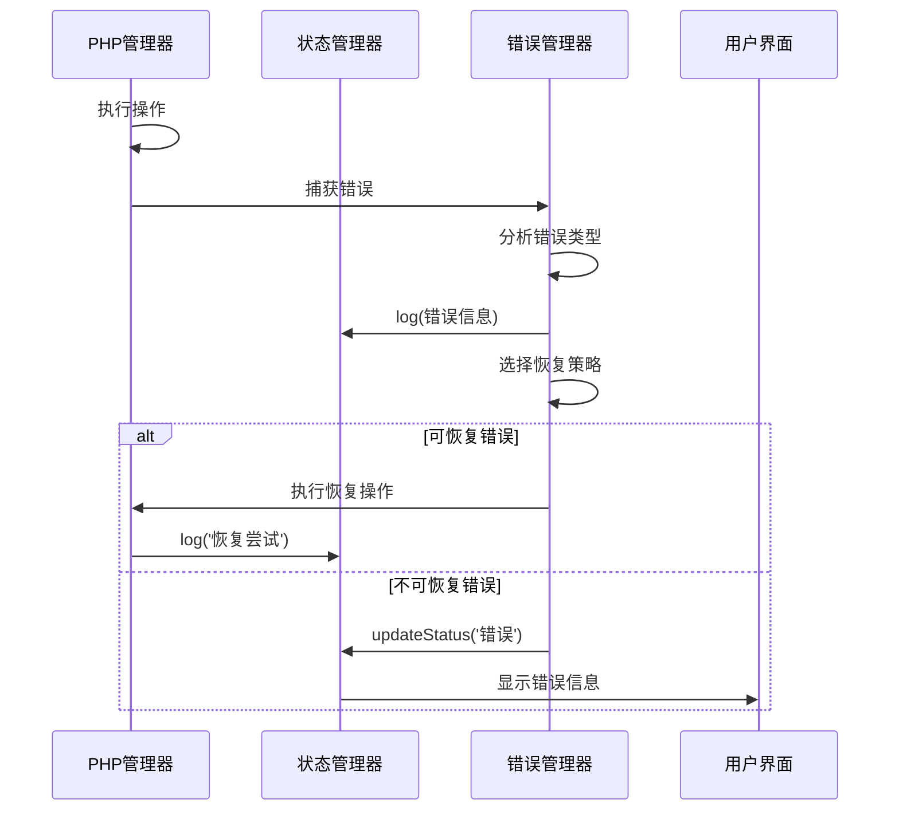

# Niva PHP Server 架构设计

## 🏗️ 系统架构概览

```mermaid
graph TB
    subgraph "用户界面层 (UI Layer)"
        A[HTML 界面]
        B[CSS 样式]
        C[JavaScript 控制器]
    end
    
    subgraph "核心业务层 (Core Business Layer)"
        D[应用管理器 (App Manager)]
        E[PHP 管理器 (PHP Manager)]
        F[网络管理器 (Network Manager)]
        G[状态管理器 (State Manager)]
    end
    
    subgraph "系统接口层 (System Interface Layer)"
        H[Niva API]
        I[文件系统 API]
        J[进程管理 API]
        K[HTTP 客户端 API]
    end
    
    subgraph "外部资源 (External Resources)"
        L[PHP 下载源]
        M[Composer 下载源]
        N[本地文件系统]
        O[系统进程]
    end
    
    A --> C
    B --> C
    C --> D
    D --> E
    D --> F
    D --> G
    
    E --> H
    F --> H
    G --> H
    
    H --> I
    H --> J
    H --> K
    
    I --> N
    J --> O
    K --> L
    K --> M
```

## 📦 模块详细设计

### 1. 用户界面层 (UI Layer)

#### HTML 界面 (index.html)
- **职责**: 提供用户交互界面
- **组件**:
  - 服务器状态显示区
  - 日志输出区域
  - PHP 应用预览框架
  - 控制按钮区域

#### CSS 样式 (styles.css)
- **职责**: 界面样式和响应式设计
- **特性**:
  - 现代化 UI 设计
  - 响应式布局
  - 状态指示器样式
  - 动画效果

#### JavaScript 控制器 (app.js)
- **职责**: 业务逻辑控制和用户交互
- **核心功能**:
  - 事件处理
  - 状态更新
  - 错误处理
  - 界面控制

### 2. 核心业务层 (Core Business Layer)

#### 应用管理器 (App Manager)
```javascript
const appManager = {
    // 应用初始化
    initApp: async () => {},
    
    // 主要工作流程控制
    startWorkflow: async () => {},
    
    // 错误处理
    handleError: (error) => {},
    
    // 清理资源
    cleanup: async () => {}
};
```

#### PHP 管理器 (PHP Manager)
```javascript
const phpManager = {
    // PHP 环境检测
    trySystemPhp: async () => {},
    downloadAndExtractPhp: async () => {},
    
    // 项目管理
    extractPhpProject: async () => {},
    detectPhpFramework: async (workingDir) => {},
    
    // Composer 管理
    findComposer: async (workingDir) => {},
    downloadComposer: async (workingDir) => {},
    runComposerInstall: async (workingDir, composerPath, phpPath) => {},
    
    // 服务器管理
    startServer: async () => {},
    stopServer: async () => {},
    buildServerCommand: async (workingDir, framework, documentRoot, phpPath) => {}
};
```

#### 网络管理器 (Network Manager)
```javascript
const network = {
    // 端口检查
    checkPort: async (port) => {},
    
    // HTTP 健康检查
    healthCheck: async (url) => {},
    
    // 下载管理
    downloadFile: async (url, destination) => {},
    
    // 网络状态检测
    checkConnectivity: async () => {}
};
```

#### 状态管理器 (State Manager)
```javascript
const state = {
    // 状态数据
    currentStatus: 'initializing',
    logs: [],
    serverInfo: {},
    
    // 状态更新方法
    updateStatus: (message, type) => {},
    log: (message, type) => {},
    
    // 状态查询
    getStatus: () => {},
    getLogs: () => {}
};
```

### 3. 系统接口层 (System Interface Layer)

#### Niva API 封装
```javascript
const nivaWrapper = {
    // 文件系统操作
    fs: {
        exists: async (path) => {},
        read: async (path) => {},
        write: async (path, content) => {},
        createDirAll: async (path) => {},
        remove: async (path) => {}
    },
    
    // 进程管理
    process: {
        exec: async (command, args, options) => {},
        spawn: async (command, args, options) => {},
        kill: async (pid) => {}
    },
    
    // HTTP 客户端
    http: {
        get: async (url) => {},
        post: async (url, data) => {},
        download: async (url, destination) => {}
    },
    
    // 系统信息
    os: {
        info: async () => {},
        dirs: async () => {}
    }
};
```

## 🔄 数据流设计

### 1. 启动流程数据流



### 2. 错误处理数据流



## 🛡️ 安全设计

### 1. 输入验证
- **路径安全**: 防止路径遍历攻击
- **命令注入**: 参数转义和验证
- **文件类型**: 限制可执行文件类型

### 2. 权限控制
- **最小权限**: 仅请求必要的系统权限
- **沙箱运行**: 在受限环境中执行外部命令
- **资源限制**: 限制内存和 CPU 使用

### 3. 错误处理
- **敏感信息**: 避免泄露系统路径和配置
- **错误日志**: 安全地记录和显示错误
- **异常恢复**: 优雅地处理异常情况

## 🚀 性能优化

### 1. 异步处理
```javascript
// 并行执行多个检查
const checks = await Promise.all([
    checkSystemPhp(),
    checkComposer(),
    checkProjectFiles()
]);
```

### 2. 缓存策略
```javascript
// 缓存检测结果
const cache = {
    phpPath: null,
    composerPath: null,
    frameworkInfo: null
};
```

### 3. 资源管理
```javascript
// 自动清理资源
const cleanup = async () => {
    if (processPid) {
        await killProcess(processPid);
    }
    await clearTempFiles();
};
```

## 📈 扩展性设计

### 1. 插件架构
```javascript
const plugins = {
    frameworks: {
        'custom-framework': {
            detect: async (workingDir) => {},
            start: async (config) => {}
        }
    },
    
    downloaders: {
        'custom-source': {
            download: async (url, destination) => {}
        }
    }
};
```

### 2. 配置系统
```javascript
const config = {
    // 可配置的参数
    ports: [3000, 3001, 3002],
    downloadSources: {
        php: ['source1', 'source2'],
        composer: ['source1', 'source2']
    },
    timeouts: {
        download: 60000,
        startup: 30000
    }
};
```

### 3. 事件系统
```javascript
const eventBus = {
    events: {},
    
    on: (event, callback) => {},
    emit: (event, data) => {},
    off: (event, callback) => {}
};
```

## 🔍 监控和调试

### 1. 日志系统
- **分级日志**: ERROR, WARN, INFO, DEBUG
- **结构化日志**: JSON 格式便于分析
- **性能日志**: 记录关键操作耗时

### 2. 状态监控
- **实时状态**: 服务器运行状态
- **资源使用**: 内存和 CPU 监控
- **错误统计**: 错误类型和频率

### 3. 调试工具
- **详细日志**: 开发模式下的详细输出
- **状态导出**: 导出当前状态用于分析
- **手动控制**: 提供手动操作接口

---

这个架构设计确保了系统的可维护性、可扩展性和稳定性，同时提供了良好的用户体验。
