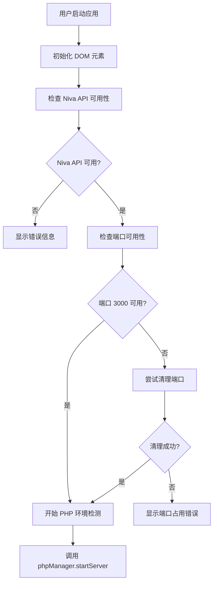
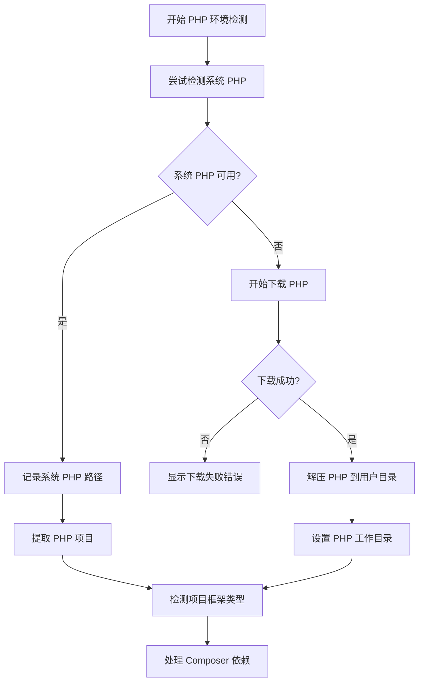
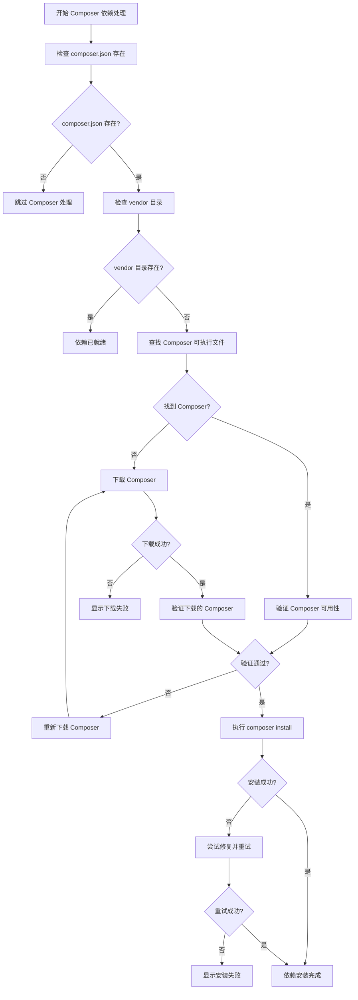
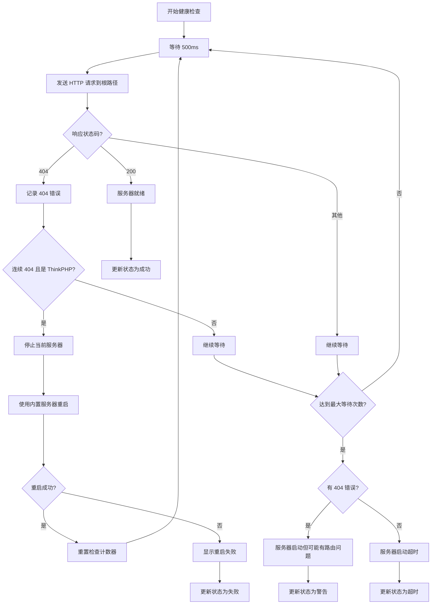

# Niva PHP Server 流程图详解

本文档详细说明了 Niva PHP Server 的各个工作流程和决策逻辑。

## 🔄 主要工作流程

### 1. 应用启动流程



### 2. PHP 环境检测和设置流程



### 3. Composer 依赖管理流程



### 4. PHP 框架检测流程

```mermaid
graph TD
    A[开始框架检测] --> B[检查 Laravel 特征]
    B --> C{artisan + app 目录存在?}
    
    C -->|是| D[识别为 Laravel]
    C -->|否| E[检查 Symfony 特征]
    
    E --> F{bin/console + src 存在?}
    F -->|是| G[识别为 Symfony]
    F -->|否| H[检查 ThinkPHP 特征]
    
    H --> I{think 文件存在?}
    I -->|是| J[识别为 ThinkPHP 5/6]
    I -->|否| K[检查 CodeIgniter 特征]
    
    K --> L{system + index.php 存在?}
    L -->|是| M{public 目录存在?}
    M -->|是| N[识别为 CodeIgniter 4]
    M -->|否| O[识别为 CodeIgniter 3]
    
    L -->|否| P[检查 Yii 特征]
    P --> Q{yii 文件存在?}
    Q -->|是| R[识别为 Yii 2]
    Q -->|否| S{protected 目录存在?}
    
    S -->|是| T[识别为 Yii 1]
    S -->|否| U[检查普通 PHP 项目]
    
    U --> V{public/index.php 存在?}
    V -->|是| W[普通 PHP 项目 (public)]
    V -->|否| X{index.php 存在?}
    
    X -->|是| Y[普通 PHP 项目]
    X -->|否| Z[未知项目类型]
```

### 5. 服务器启动流程

```mermaid
graph TD
    A[开始启动服务器] --> B[根据框架构建启动命令]
    B --> C[验证可执行文件存在]
    C --> D{文件存在?}
    
    D -->|否| E[显示文件不存在错误]
    D -->|是| F[尝试 exec(detached) 启动]
    
    F --> G{启动成功?}
    G -->|是| H[记录进程 PID]
    G -->|否| I[尝试 spawn 启动]
    
    I --> J{启动成功?}
    J -->|是| H
    J -->|否| K[尝试 exec(normal) 启动]
    
    K --> L{启动成功?}
    L -->|是| H
    L -->|否| M{是 ThinkPHP?}
    
    M -->|是| N[尝试内置服务器回退]
    M -->|否| O[显示启动失败]
    
    N --> P{回退成功?}
    P -->|是| H
    P -->|否| O
    
    H --> Q[开始健康检查]
```

### 6. 健康检查和错误处理流程



## 🔧 关键决策点说明

### 1. PHP 环境选择策略
- **优先级**: 系统 PHP > 下载 PHP
- **原因**: 系统 PHP 通常更稳定，配置更完整
- **回退**: 系统 PHP 不可用时自动下载

### 2. Composer 管理策略
- **检测顺序**: 本地 composer.phar > 系统 composer > 下载
- **验证方式**: 文件大小检查 + 功能测试
- **错误处理**: 自动重新下载损坏的文件

### 3. 框架启动策略
- **优先级**: 框架特定命令 > PHP 内置服务器
- **ThinkPHP**: `think run --root public` > `php -S -t public`
- **Laravel**: `artisan serve` > `php -S -t public`
- **回退机制**: 框架命令失败时自动使用内置服务器

### 4. 错误恢复策略
- **404 错误**: 连续检测到 404 时自动重启为内置服务器
- **启动失败**: 多种启动方式依次尝试
- **文件损坏**: 自动重新下载和验证

## 📊 性能优化点

### 1. 并发处理
- 异步文件操作
- 非阻塞进程启动
- 并行健康检查

### 2. 缓存策略
- 已下载文件的重用
- 框架检测结果缓存
- 进程状态缓存

### 3. 错误预防
- 文件完整性验证
- 进程状态监控
- 自动清理机制

## 🚨 异常处理机制

### 1. 网络异常
- 下载超时处理
- 连接失败重试
- 备用下载源

### 2. 文件系统异常
- 权限不足处理
- 磁盘空间检查
- 路径安全验证

### 3. 进程异常
- 进程意外退出
- 端口占用冲突
- 资源泄漏防护

---

这些流程图展示了 Niva PHP Server 的完整工作机制，确保在各种环境下都能稳定运行。
