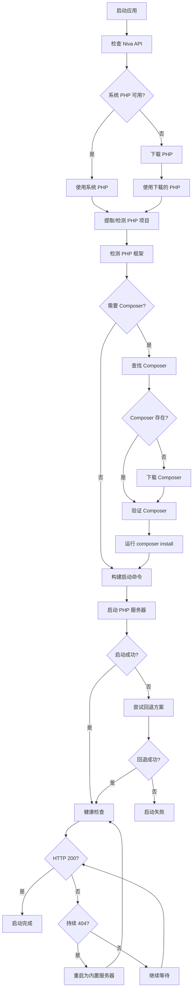

# Niva PHP Server

一个基于 Niva 框架的 PHP 项目管理和服务器启动工具，支持多种 PHP 框架的自动检测、依赖管理和服务器启动。

## 🚀 功能特性

### 核心功能
- **🔍 智能框架检测**: 自动识别 Laravel、Symfony、ThinkPHP、CodeIgniter、Yii 等主流 PHP 框架
- **📦 自动依赖管理**: 智能下载和管理 PHP、Composer，自动安装项目依赖
- **🌐 多平台支持**: 支持 Windows、macOS、Linux 系统
- **⚡ 快速启动**: 一键启动 PHP 开发服务器
- **🔧 智能回退**: 框架启动失败时自动回退到 PHP 内置服务器
- **🎯 沉浸式体验**: PHP服务器启动后自动隐藏控制面板，全屏显示应用
- **🖥️ 智能全屏**: 使用Niva原生API实现真正的窗口全屏模式
- **💡 动态提示**: 实时状态提示系统，支持用户交互和自动隐藏
- **🛡️ 进程管理**: 强化的进程清理机制，确保应用关闭时完全释放资源

### 支持的 PHP 框架
- **Laravel**: 使用 `artisan serve` 命令启动
- **Symfony**: 使用 `bin/console server:run` 命令启动
- **ThinkPHP 5/6**: 使用 `think run` 命令启动
- **CodeIgniter 4**: 使用 `spark serve` 命令启动
- **Yii 2**: 使用 `yii serve` 命令启动
- **普通 PHP 项目**: 使用 PHP 内置服务器启动

## 📋 系统要求

- **Niva 框架**: 需要在 Niva 应用环境中运行
- **操作系统**: Windows 10+、macOS 10.14+、Linux (Ubuntu 18.04+)
- **网络连接**: 用于下载 PHP 和 Composer（如果系统未安装）

## 🛠️ 安装和使用

### 1. 项目结构
```
niva-php-server/
├── index.html          # 主界面
├── js/
│   └── app.js          # 核心逻辑
├── css/
│   └── styles.css      # 样式文件
├── niva.json           # Niva 配置
├── index.php           # PHP 测试页面
└── README.md           # 项目文档
```

### 2. 启动应用
1. 在 Niva 环境中打开项目
2. 应用会自动检测系统环境
3. 如需要会自动下载 PHP 和 Composer
4. 自动检测和启动 PHP 项目

### 3. 使用流程
1. **环境检测**: 检查系统 PHP 和 Composer 可用性
2. **项目检测**: 自动识别 PHP 框架类型
3. **依赖安装**: 自动运行 `composer install`（如果需要）
4. **服务器启动**: 根据框架类型选择最佳启动方式
5. **界面切换**: 自动隐藏控制面板，切换到全屏模式
6. **健康检查**: 验证服务器是否正常运行

### 4. 全屏模式体验
- **自动全屏**: PHP服务器启动成功后自动进入全屏模式
- **智能提示**: 右上角显示状态提示，可手动关闭
- **快捷操作**: 按 `Esc` 键退出全屏模式
- **状态同步**: 实时监听全屏状态变化，动态更新提示内容

## 🔄 工作流程

### 主要流程图



### 框架检测流程

```mermaid
graph TD
    A[开始检测] --> B{存在 artisan + app?}
    B -->|是| C[Laravel]
    B -->|否| D{存在 bin/console + src?}

    D -->|是| E[Symfony]
    D -->|否| F{存在 think?}

    F -->|是| G[ThinkPHP 5/6]
    F -->|否| H{存在 system + index.php?}

    H -->|是| I{存在 public?}
    I -->|是| J[CodeIgniter 4]
    I -->|否| K[CodeIgniter 3]

    H -->|否| L{存在 yii?}
    L -->|是| M[Yii 2]
    L -->|否| N{存在 protected?}

    N -->|是| O[Yii 1]
    N -->|否| P{存在 public/index.php?}

    P -->|是| Q[普通 PHP (public)]
    P -->|否| R{存在 index.php?}

    R -->|是| S[普通 PHP]
    R -->|否| T[未知项目]
```

## 📊 技术架构

### 核心模块

1. **环境管理 (Environment Manager)**
   - PHP 检测和下载
   - Composer 管理
   - 系统兼容性检查

2. **项目管理 (Project Manager)**
   - 框架自动检测
   - 项目文件提取
   - 依赖安装管理

3. **服务器管理 (Server Manager)**
   - 多种启动方式
   - 进程管理
   - 健康检查

4. **用户界面 (UI Manager)**
   - 实时状态显示
   - 日志输出
   - 错误处理

5. **全屏管理 (Fullscreen Manager)**
   - Niva原生全屏API集成
   - 全屏状态监听和同步
   - 动态提示系统
   - 键盘事件处理

6. **进程管理 (Process Manager)**
   - 双重进程清理机制
   - 端口占用检测和释放
   - 优雅终止和强制清理
   - 页面生命周期管理

### 关键特性

- **智能回退机制**: 框架启动失败时自动使用 PHP 内置服务器
- **健康检查**: 持续监控服务器状态，自动处理 404 错误
- **跨平台兼容**: 支持不同操作系统的命令和路径处理
- **错误恢复**: 自动重试和错误修复机制
- **沉浸式体验**: 自动全屏模式，隐藏控制界面，专注应用内容
- **智能提示**: 动态状态提示，支持用户交互和自动管理
- **资源管理**: 强化的进程和端口清理，确保系统资源完全释放

## 🔧 配置选项

### 默认配置
```javascript
const CONFIG = {
    PHP_PORT: 3000,                    // PHP 服务器端口
    DOWNLOAD_TIMEOUT: 60000,           // 下载超时时间
    SERVER_START_TIMEOUT: 20000,       // 服务器启动超时
    HEALTH_CHECK_INTERVAL: 500         // 健康检查间隔
};
```

### 支持的环境变量
- `COMPOSER_HOME`: Composer 工作目录
- `PHP_BINARY`: 自定义 PHP 可执行文件路径

## 🐛 故障排除

### 常见问题

1. **PHP 下载失败**
   - 检查网络连接
   - 确认防火墙设置
   - 尝试手动下载 PHP

2. **Composer 安装失败**
   - 检查 composer.json 文件格式
   - 确认依赖包可用性
   - 清理 vendor 目录重试

3. **服务器启动失败**
   - 检查端口占用情况
   - 确认 PHP 文件权限
   - 查看详细错误日志

4. **404 错误**
   - 检查项目入口文件
   - 确认框架路由配置
   - 尝试直接访问 index.php

### 调试模式
应用提供详细的日志输出，包括：
- 环境检测结果
- 文件操作状态
- 命令执行输出
- 错误堆栈信息

## 📝 更新日志

### v1.2.0 (2025-05-25)
- 🎯 **全屏模式优化**
  - ✅ 使用 Niva.api.window.setFullscreen 替代浏览器全屏API
  - ✅ 添加智能全屏状态监听和事件处理
  - ✅ 实现可关闭的动态提示框系统
  - ✅ 支持Esc键退出全屏，自动状态同步
- 🛡️ **进程管理增强**
  - ✅ 改进PHP进程清理机制，确保端口完全释放
  - ✅ 添加双重清理策略（PID + 端口检测）
  - ✅ 优雅终止进程，支持强制清理备用方案
  - ✅ 新增页面卸载时的自动清理处理
- 🎨 **用户体验提升**
  - ✅ PHP服务器启动后自动隐藏控制面板界面
  - ✅ iframe自动全屏显示，提供沉浸式体验
  - ✅ 动态提示系统，实时反馈全屏状态变化
  - ✅ 美观的提示框设计，支持用户手动关闭

### v1.1.0 (2025-05-23)
- 🔧 **界面模式切换**
  - ✅ 实现PHP服务器模式自动切换
  - ✅ 添加CSS样式控制界面元素显示/隐藏
  - ✅ 优化iframe容器全屏显示效果
- 📱 **响应式设计**
  - ✅ 改进移动设备和不同屏幕尺寸的适配
  - ✅ 优化触摸设备的交互体验

### v1.0.0 (2025-05-22)
- ✅ 初始版本发布
- ✅ 支持主流 PHP 框架检测
- ✅ 自动 PHP 和 Composer 管理
- ✅ 智能启动和回退机制
- ✅ 跨平台兼容性

## 🤝 贡献指南

欢迎提交 Issue 和 Pull Request 来改进项目！

### 开发环境设置
1. 克隆项目到本地
2. 在 Niva 环境中打开
3. 修改代码并测试
4. 提交 Pull Request

## 📄 许可证

本项目采用 MIT 许可证 - 查看 [LICENSE](LICENSE) 文件了解详情。

## 📚 详细文档

- [流程图详解](FLOWCHART.md) - 详细的工作流程图和决策逻辑
- [架构设计](ARCHITECTURE.md) - 系统架构和模块设计说明

## 🎯 使用示例

### 启动 Laravel 项目
1. 将 Laravel 项目文件放入 `www.zip`
2. 启动 Niva PHP Server
3. 应用自动检测到 Laravel 框架
4. 自动运行 `composer install`
5. 使用 `php artisan serve` 启动服务器

### 启动 ThinkPHP 项目
1. 将 ThinkPHP 项目文件放入 `www.zip`
2. 启动应用
3. 自动检测 ThinkPHP 5/6 框架
4. 安装 Composer 依赖
5. 使用 `php think run` 启动，失败时自动回退到内置服务器

### 普通 PHP 项目
1. 将 PHP 文件放入项目目录
2. 应用自动创建默认的 `index.php`
3. 使用 PHP 内置服务器启动

## 🔧 高级配置

### 自定义端口
```javascript
// 在 js/app.js 中修改
const CONFIG = {
    PHP_PORT: 8080  // 改为你想要的端口
};
```

### 自定义下载源
```javascript
// 添加备用下载源
const DOWNLOAD_SOURCES = {
    php: [
        'https://windows.php.net/downloads/releases/',
        'https://backup-source.com/php/'
    ],
    composer: [
        'https://getcomposer.org/composer-stable.phar',
        'https://backup-source.com/composer.phar'
    ]
};
```

## 🙏 致谢

- [Niva Framework](https://bramblex.github.io/niva/) - 提供跨平台应用框架
- PHP 社区 - 提供优秀的 PHP 生态系统
- Composer - 提供依赖管理工具

---

**注意**: 本项目需要在 Niva 应用环境中运行，不支持直接在浏览器中使用。
